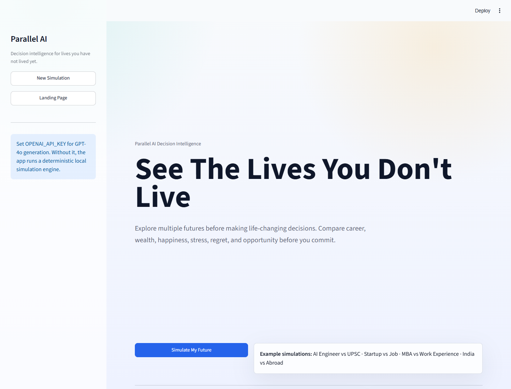
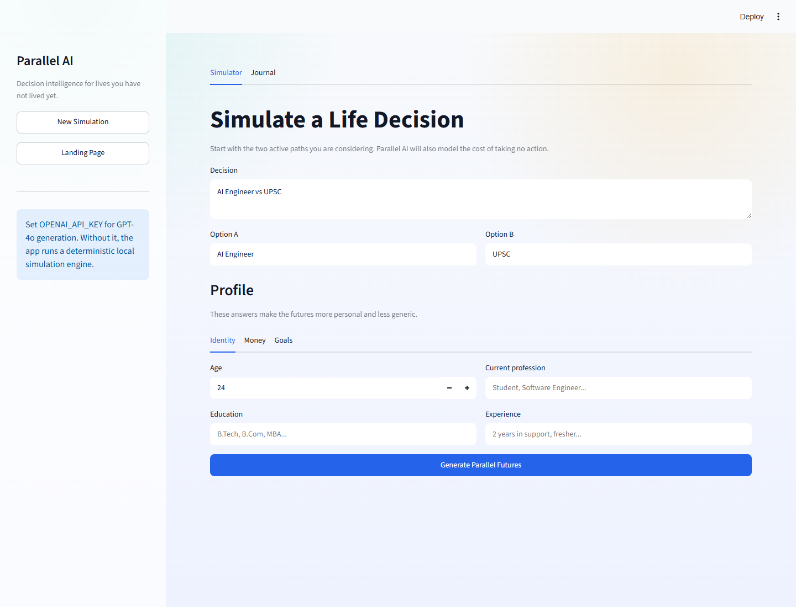
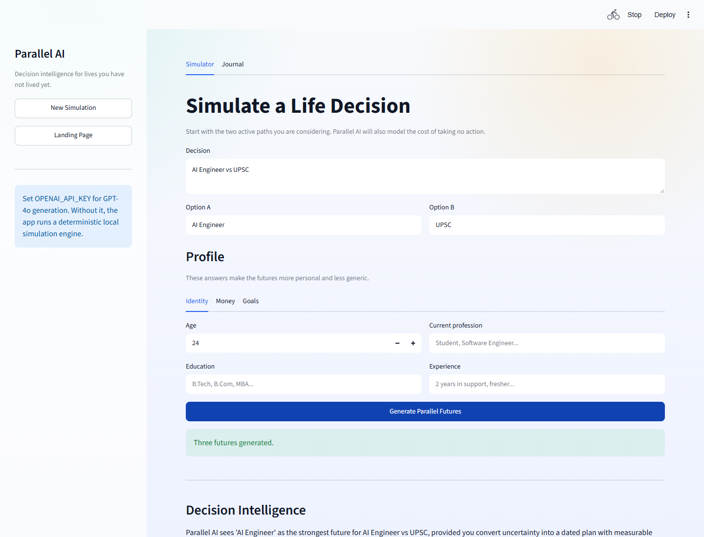
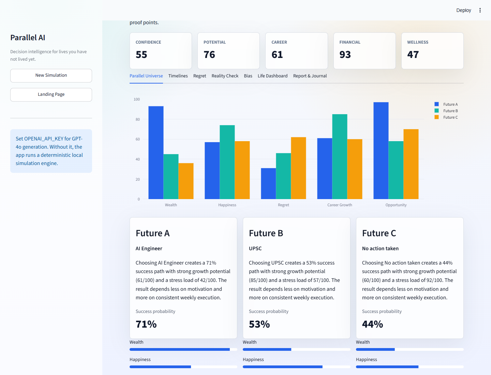
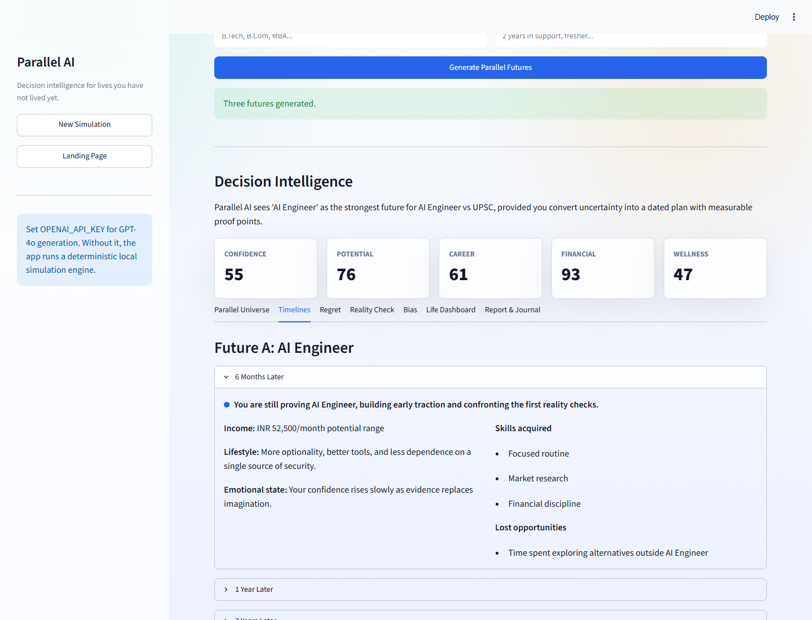
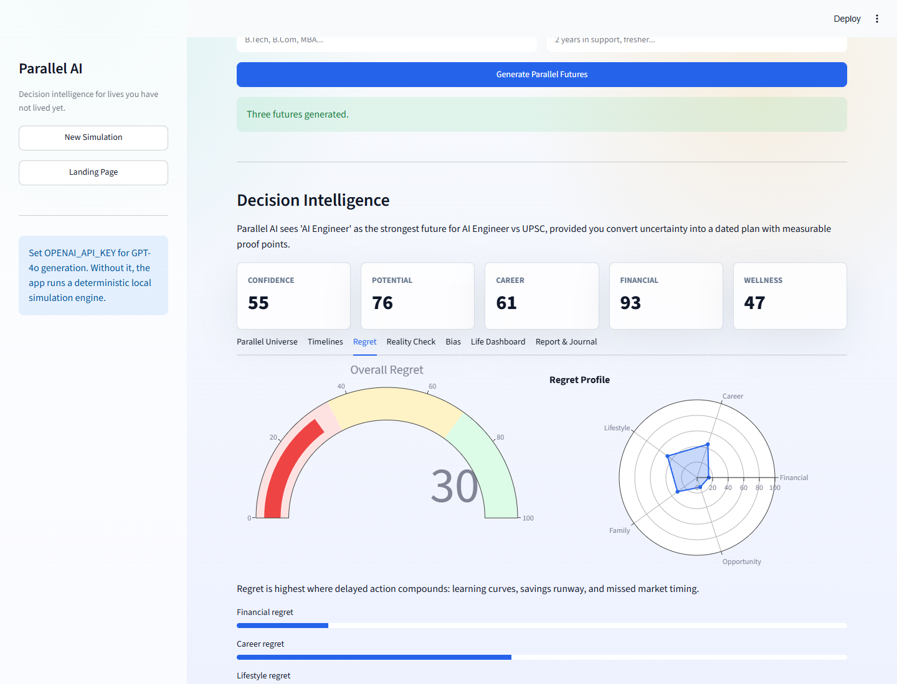
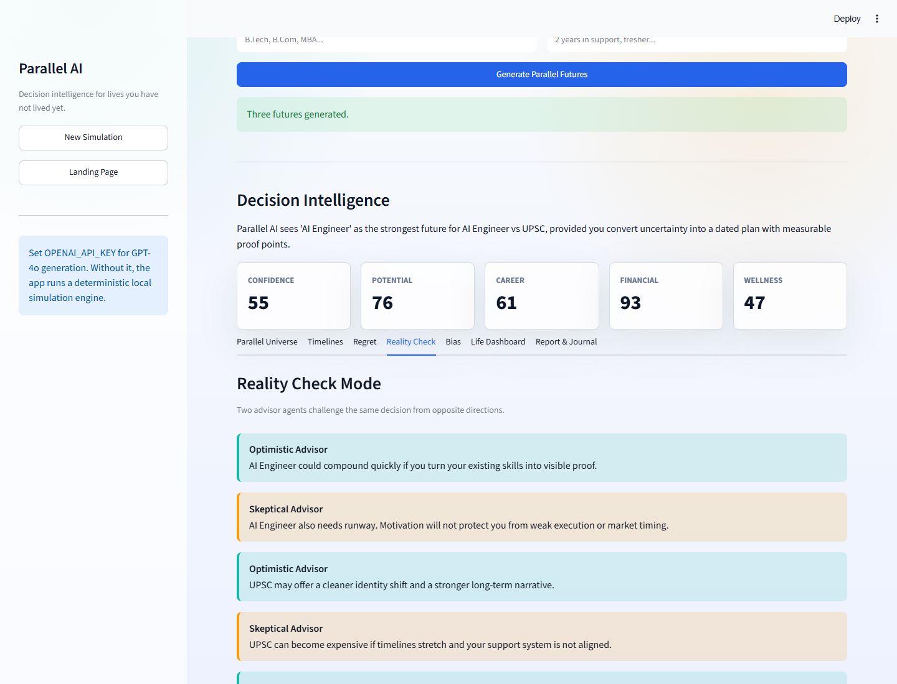
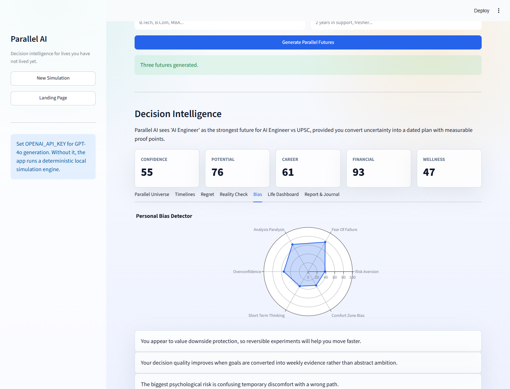

# Parallel AI

**See The Lives You Don't Live**

Parallel AI is a Streamlit decision intelligence platform that simulates three versions of a user's future before a major life decision:

- Future A: Option A chosen
- Future B: Option B chosen
- Future C: No action taken

It includes future timelines, regret analysis, advisor debate, bias detection, alternate-life generation, fictional future headlines, a decision journal, and PDF report export.

## Features

- Premium Streamlit landing page and onboarding wizard
- GPT-4o/OpenAI integration with structured JSON outputs
- Deterministic local simulation fallback when no API key is configured
- Plotly gauge, radar, comparison, and opportunity-cost charts
- SQLite decision journal
- Future letters with copy and download controls
- PDF report generation with ReportLab
- Docker-ready deployment

## UI Screenshots

### Landing Page



### Onboarding Wizard



### Dashboard Overview



### Parallel Universe Comparison



### Future Timelines



### Regret Calculator



### Reality Check Mode



### Bias Detector



## Project Structure

```text
.
├── app.py
├── parallel_ai/
│   ├── data/
│   │   └── schema.sql
│   ├── models.py
│   ├── services/
│   │   ├── database.py
│   │   ├── pdf_report.py
│   │   ├── prompts.py
│   │   └── simulation.py
│   └── ui/
│       ├── charts.py
│       └── styles.py
├── requirements.txt
├── Dockerfile
├── .env.example
└── .streamlit/config.toml
```

## Local Setup

```bash
python -m venv .venv
.venv\Scripts\activate
pip install -r requirements.txt
copy .env.example .env
```

Set your OpenAI key in `.env` or in the shell:

```powershell
$env:OPENAI_API_KEY="sk-your-key-here"
$env:OPENAI_MODEL="gpt-4o-2024-08-06"
```

Run the app:

```bash
streamlit run app.py
```

On Windows, the included launcher uses the project virtualenv:

```powershell
.\run_app.ps1
```

The app still runs without `OPENAI_API_KEY` using a deterministic local simulation engine, which is useful for demos and offline development.

## Docker

```bash
docker build -t parallel-ai .
docker run --rm -p 8501:8501 --env-file .env parallel-ai
```

Open `http://localhost:8501`.

## Deployment

### Streamlit Community Cloud

1. Push this project to GitHub.
2. Create a Streamlit app from the repository.
3. Set `OPENAI_API_KEY` and optionally `OPENAI_MODEL` in Streamlit secrets.
4. Use `app.py` as the entrypoint.

### Render, Railway, or Fly.io

Use the included Dockerfile. Set `OPENAI_API_KEY` as an environment variable and expose port `8501`.

## Data

The decision journal is stored in `parallel_ai.db` in the project root. The schema is defined in `parallel_ai/data/schema.sql`.

## Notes

OpenAI generation uses the Responses API with JSON schema formatting. If the API call fails, the app keeps the user experience intact by generating a local simulation and showing a warning.
